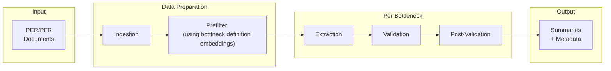

# PFM Bottleneck Analysis System

Identifies and validates bottlenecks in public finance documents (PER and PFR from World Bank Imagebank) using a schema-driven approach with LLM-based extraction and validation.

## Pipeline Overview



**Per bottleneck:** Run extraction once (stable), iterate on validation as schemas improve.

## Pipeline Runner

The main entry point is the pipeline_runner notebook.

```python
SCHEMA = "prd_mega.sboost4"
BOTTLENECK_ID = "6.1"

run_ingestion_step(spark, SCHEMA, DOCS_TABLE, CHUNKS_TABLE)

run_prefilter_step(spark, SCHEMA, CHUNKS_TABLE, PREFILTER_RESULTS_TABLE)

run_extraction_step(spark, dbutils, SCHEMA, CHUNKS_TABLE, PREFILTER_RESULTS_TABLE, BOTTLENECK_ID)

run_validation_step(spark, dbutils, SCHEMA, BOTTLENECK_ID)
```

## File Structure

| File | Purpose |
|------|---------|
| `pipeline_runner` | Main orchestration |
| `document_ingestion` | Data curation |
| `prefilter` | Embedding-based filtering (sentence-transformers) |
| `evidence_extraction` | Extract evidence spans from chunks (per bottleneck)|\
| `evidence_validation` | Validate extractions against schema cues and decide if ecidence span is valid evidence |
| `post_validation` | Generate additional useful information and stand-alone summaries from validated evidence |
| `bottleneck_schemas` | Cues, hard negatives, acceptance rules per bottleneck |
| `bottleneck_definitions` | 28 bottleneck definitions across 9 challenges |
| `service` | Azure OpenAI + instructor wrapper |
| `imports` | Consolidated way to import all required modules using `%run`|
| `consts` | Consolidated place for variables, parameters and system prompts|

## Key Concepts

### Validation Schema

Each bottleneck has a schema in `bottleneck_schemas`:

- **Strong cues**: Any ONE is sufficient for acceptance
- **Moderate cues**: Need TWO or more
- **Hard negatives**: Auto-reject if detected
- **Acceptance rule**: `strong >= 1 OR moderate >= 2`

### Decision Types

- `relevant`: Cues met, no hard negatives
- `relevant_with_failure`: Cues met + consequence mentioned
- `irrelevant`: Hard negative or no qualifying cues
- `abstain`: Uncertain


## Output Tables

Per bottleneck (e.g., 6.1):
- `bottleneck_6_1_extractions` - Raw extractions
- `bottleneck_6_1_results` - Validation decisions
- `bottleneck_6_1_summaries` - Stylized summaries with metadata

## Adding New Bottlenecks

1. Update schema in `bottleneck_schemas` with cues and hard negatives
2. Run extraction step (once)
3. Run validation step (iterate until required precision is acheived)
4. Run post-validation for summaries and additional information

## Notes

1. Due to issues with imports from .py files I converted everything to notebooks and the imports are handled by running `%run imports` in the `pipeline_runner`.

## TODO:

1. See if the current format for validation is sufficiently flexible to accomodate the changes across bottlenecks
2. Extract extended definitions from the new PFM document to update `bottleneck_definitions`
3. Add databricks pipeline to aggregate final summary tables (after joining with `pfm_document_data` table) into one table for all bottlenecks
4. Change condition to check for specific (node_id, chunk_id) pairs to skip certain steps in pipeline_runner. Currently, we check for existence of table which is insufficient
5. Add a new nnotebook to compute the precision against expert annotated data from the volume
6. Add helper function to format the output into an excel file for update and sharing
