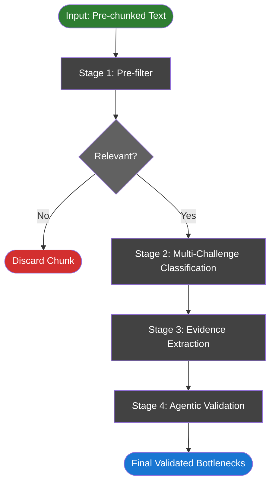
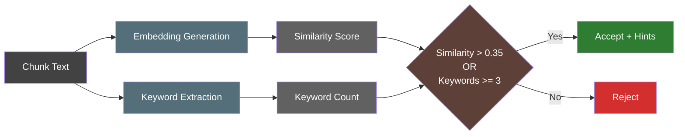
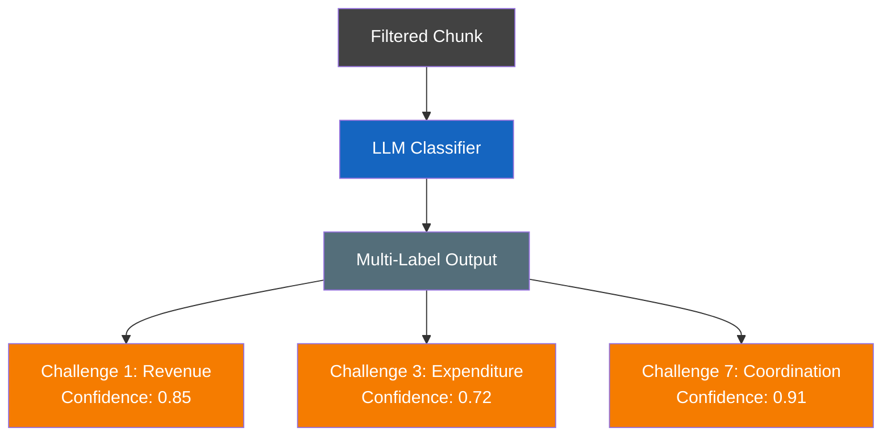
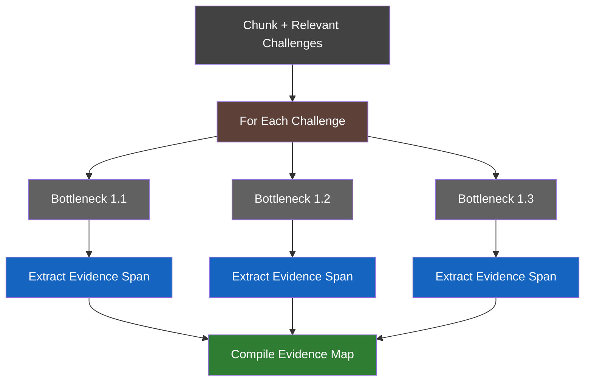
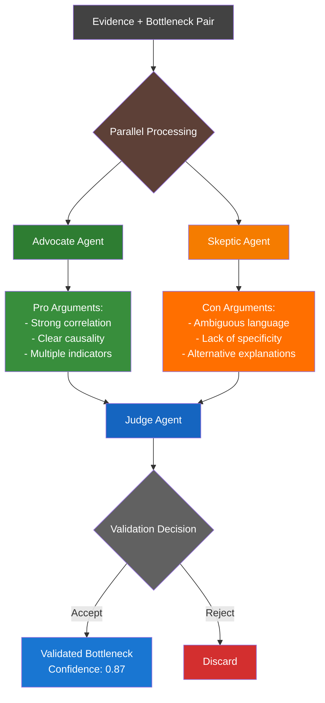
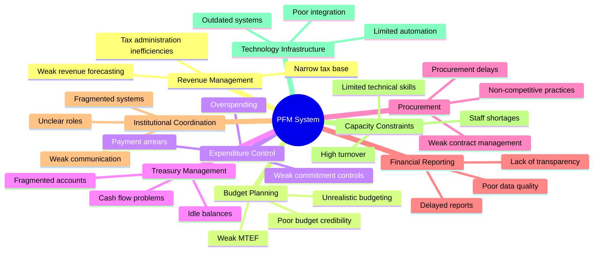
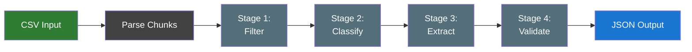

# PFM Bottleneck Analysis System

## Overview

The PFM (Public Finance Management) Bottleneck Analysis System is a text processing pipeline designed to identify, classify, and validate bottlenecks in public finance documents. The system processes pre-chunked text through a multi-stage pipeline that balances recall in early stages with precision in final validation.

## System Architecture

### High-Level Pipeline Flow



## Detailed Stage Descriptions

### Stage 1: Pre-filter
**Purpose:** Remove clearly irrelevant chunks to reduce processing overhead
**Approach:** Dual-path acceptance using embeddings and keyword matching
**Output:** Boolean relevance flag + processing hints



**Key Features:**
- No LLM calls (cost-effective)
- Uses sentence-transformers (all-mpnet-base-v2)
- Optimized for high recall

### Stage 2: Multi-Challenge Classification
**Purpose:** Classify chunks into relevant PF Challenges (multi-label)
**Approach:** LLM-based multi-label classification
**Output:** List of relevant challenges with confidence scores



**Classification Schema:**
```python
{
    "chunk_id": "unique_identifier",
    "challenges": [
        {
            "challenge_id": 1,
            "challenge_name": "Revenue Management",
            "confidence": 0.85,
            "reasoning": "References tax collection inefficiencies"
        },
        {
            "challenge_id": 7,
            "challenge_name": "Institutional Coordination",
            "confidence": 0.91,
            "reasoning": "Discusses inter-agency communication issues"
        }
    ]
}
```

### Stage 3: Evidence Extraction
**Purpose:** Extract specific evidence spans for each bottleneck under relevant challenges
**Approach:** Structured extraction using LLM with targeted prompts
**Output:** Evidence spans mapped to specific bottlenecks



**Evidence Schema:**
```python
{
    "chunk_id": "unique_identifier",
    "evidence_map": [
        {
            "bottleneck_id": "1.1",
            "bottleneck_name": "Weak revenue forecasting",
            "evidence_span": "Revenue projections consistently overestimate by 20-30%...",
            "span_start": 145,
            "span_end": 289,
            "relevance_score": 0.78
        }
    ]
}
```

### Stage 4: Agentic Validation
**Purpose:** High-precision validation using multi-agent debate
**Approach:** Three-agent system with advocate, skeptic, and judge
**Output:** Final validated bottlenecks with confidence scores



## Agent Specifications

### Advocate Agent
**Role:** Build the strongest case for bottleneck relevance
**Focus:** Identify supporting evidence and connections
**Output Structure:**
```python
{
    "agent": "advocate",
    "bottleneck_id": "1.1",
    "argument": {
        "main_points": [...],
        "supporting_evidence": [...],
        "confidence": 0.82
    }
}
```

### Skeptic Agent
**Role:** Challenge the bottleneck assignment
**Focus:** Find weaknesses and alternative interpretations
**Output Structure:**
```python
{
    "agent": "skeptic",
    "bottleneck_id": "1.1",
    "argument": {
        "challenges": [...],
        "alternative_interpretations": [...],
        "weakness_score": 0.65
    }
}
```

### Judge Agent
**Role:** Evaluate both arguments and make final decision
**Focus:** Balanced assessment with justification
**Output Structure:**
```python
{
    "agent": "judge",
    "bottleneck_id": "1.1",
    "decision": "accept",
    "confidence": 0.87,
    "reasoning": "Advocate's evidence outweighs skeptic's concerns...",
    "key_factors": [...]
}
```

## PF Challenge and Bottleneck Structure

### 9 PF Challenges with 28 Bottlenecks



## Data Flow and Processing

### Input Data Format
```csv
node_id,chunk_id,chunk_text
DOC001,CHUNK001,"The revenue forecasting model has consistently..."
DOC001,CHUNK002,"Budget execution reports show significant..."
```

### Processing Pipeline Data Flow


## Performance Optimization Strategy

### Stage-wise Optimization Goals

| Stage | Primary Goal | Secondary Goal | Metrics |
|-------|-------------|----------------|---------|
| Pre-filter | High Recall (>95%) | Speed | False Negative Rate |
| Classification | Balanced (F1>0.8) | Coverage | Precision, Recall |
| Extraction | High Recall (>90%) | Relevance | Evidence Quality |
| Validation | High Precision (>95%) | Justification | False Positive Rate |


## System Components

### Core Architecture
- **Stage 1: Pre-filter** - Embeddings + keyword matching for initial filtering
- **Stage 2: Multi-Challenge Classification** - LLM-based multi-label classifier
- **Stage 3: Evidence Extraction** - Structured extraction system for evidence spans
- **Stage 4: Agentic Validation** - Three-agent debate system for final validation
- **Bottleneck Definitions** - Complete taxonomy of 28 bottlenecks across 9 challenges
- **Pipeline Orchestration** - Modular processing with stage-wise optimization


### Key Design Decisions
1. **Staged Recall-to-Precision Strategy**: Early stages optimize for recall to avoid missing potential bottlenecks, while later stages focus on precision to ensure quality
2. **Agentic Validation**: The three-agent system provides explainable AI decisions with clear reasoning trails
3. **Modular Architecture**: Each stage can be independently improved, tested, and deployed
4. **Evidence-Based Approach**: All bottleneck assignments are traceable to specific text evidence

### Performance Considerations
- Pre-filter dramatically reduces LLM costs by eliminating 60% of chunks
- Parallel processing in agentic stage for improved throughput
- Caching strategies for repeated document processing
- Batch processing optimizations for large document sets
