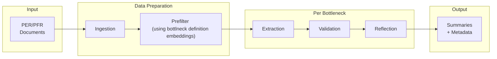

# PFM Bottleneck Analysis System

Identifies and validates bottlenecks in public finance documents (PER and PFR from World Bank Imagebank) using a schema-driven approach with LLM-based extraction and validation.

The system applies a three-stage logic to every bottleneck:

1. Extraction

We look for candidate spans inside text chunks that might correspond to a bottleneck. Extraction is intentionally high recall and uses a bespoke LLM prompt. This step is run once per bottleneck and rarely changes, unless the source data is updated.

2. Validation

Validation is the core logic of the system. For each extracted span of text which is potentially evidence for the bottleneck,a dynamic Pydantic model is created per bottleneck to enforce structured outputs. The LLM is given some indication of what serves as positive evidence, and which patterns are to be avoided. These cues are updated as required following an expert review of the outputs of the last version of this model. In addition to this, although some instructions are common to all bottlenecks these cues are specifically dervied per bottleneck.

3. Reflection (Optional)

Reflection is a second-pass QC step only on validated positives. There is evidence in the literature to suggest that a reflection pass often improves the quality of the outputs. Here we explicitly construct a reflection step where we pass the validated evidence and the bottleneck definition to the LLM to decide if the result of the previous validation stage is to be overturned.

4. Summarization (Post-Validation / Post-Reflection)

The goal of this stage is to make the extarctee evidnce which passed the previous stages to be made _stand alone_, so that it can be read independent of the source text. For every accepted evidence span (after validation OR reflection) we retrieve extended context (±2 chunks of the source chunk), extract structured metadata fields (country, issue area, constraint, consequence, metric, etc.) and generate a standalone stylized summary suitable for reporting. The summary is written using examples to match tone and format.

## Pipeline Overview



**Per bottleneck:** Run extraction once (stable), iterate on validation as schemas improve.

## Pipeline Runner

The main entry point is the pipeline_runner notebook.

```python
SCHEMA = "prd_mega.sboost4"
BOTTLENECK_ID = "6.1"

run_ingestion_step(spark, SCHEMA, DOCS_TABLE, CHUNKS_TABLE)

run_prefilter_step(spark, SCHEMA, CHUNKS_TABLE, PREFILTER_RESULTS_TABLE)

run_extraction_step(
    schema=SCHEMA,
    chunks_table=CHUNKS_TABLE,
    prefilter_results_table=PREFILTER_RESULTS_TABLE,
    bottleneck_id=BOTTLENECK_ID
)

run_validation(
    schema=SCHEMA,
    bottleneck_id=BOTTLENECK_ID,
    overwrite=False
)

run_reflection(
    schema=SCHEMA,
    bottleneck_id=BOTTLENECK_ID,
    source_table=CHUNKS_TABLE,
    overwrite=False
)

run_summary_generation(
    schema=SCHEMA,
    bottleneck_id=BOTTLENECK_ID,
    source_stage="reflection",     # or "validation"
    doc_metadata_table=DOCS_METADATA_TABLE,
    chunks_table=CHUNKS_TABLE,
    overwrite=False
)
```

## File Structure

| File | Purpose |
|------|---------|
| `pipeline_runner` | Main orchestration |
| `document_ingestion` | Data curation |
| `prefilter` | Embedding-based filtering (sentence-transformers) |
| `evidence_extraction` | Extract evidence spans from chunks (per bottleneck)|\
| `evidence_validation` | Validate extractions against schema cues and decide if ecidence span is valid evidence |
| `evidence_reflection` | Additional step to filter out false positives through a reflection step |
| `evidence_summarization` | Generate additional useful information and stand-alone summaries from validated evidence |
| `bottleneck_schemas` | Cues, hard negatives, acceptance rules per bottleneck |
| `bottleneck_definitions` | 31 Outcome-Specific Sub-Bottleneck definitions across 8 Bottlenecks |
| `service` | Azure OpenAI + instructor wrapper |
| `imports` | Consolidated way to import all required modules using `%run`|
| `consts` | Consolidated place for variables, parameters and system prompts|

## Key Concepts

### Validation Schema

Each bottleneck has a schema in `bottleneck_schemas`:

- **Strong cues**: Any ONE is sufficient for acceptance
- **Moderate cues**: Need TWO or more
- **Hard negatives**: Auto-reject if detected
- **Acceptance rule**: `strong >= 1 OR moderate >= 2`

### Decision Types

- `relevant`: Cues met, no hard negatives
- `relevant_with_failure`: Cues met + consequence mentioned
- `irrelevant`: Hard negative or no qualifying cues
- `abstain`: Uncertain


## Output Tables

Per bottleneck (e.g., 6.1):
- `bottleneck_6_1_extractions` - Raw extractions
- `bottleneck_6_1_validated_results` - Validation decisions
- `bottleneck_6_1_reflection_results` - Reflection step results
- `bottleneck_6_1_summaries_validation` - Stylized summaries with metadata when source table is the validated results table
- `bottleneck_6_1_summaries_reflection` - Stylized summaries with metadata when source table is the reflection results table


## Adding New Bottlenecks

1. Update schema in `bottleneck_schemas` with cues and hard negatives
2. Run extraction step (once)
3. Run validation step (iterate until required precision is acheived)
4. Run reflection step (once to potentially remove more flase positives)
5. Run summarization step for summaries and additional information

## Notes

1. Due to issues with imports from .py files I converted everything to notebooks and the imports are handled by running `%run imports` in the `pipeline_runner`.

## TODO:

1. See if the current format for validation is sufficiently flexible to accomodate the changes across bottlenecks
2. Extract extended definitions from the new PFM document to update `bottleneck_definitions`
3. Add databricks pipeline to aggregate final summary tables (after joining with `pfm_document_data` table) into one table for all bottlenecks
4. Change condition to check for specific (node_id, chunk_id) pairs to skip certain steps in pipeline_runner. Currently, we check for existence of table which is insufficient
5. Add a new nnotebook to compute the precision against expert annotated data from the volume
6. Add helper function to format the output into an excel file for update and sharing
