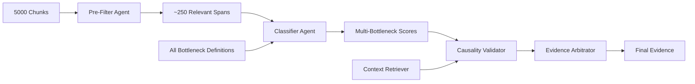

# Agentic PFM Bottleneck Analysis Pipeline

## Overview

This is an agent-based approach to PFM bottleneck identification that addresses the key limitations of the structured pipeline:
- **False positives** from overeager classification
- **Incorrect bottleneck assignment** (evidence for bottleneck A classified as B)
- **Unjustified causal claims** (inferring causation from correlation)
- **Generic evidence** lacking specific context

## Key Innovation

Instead of checking each chunk against one bottleneck at a time, this approach:
1. **Pre-filters** chunks to find potentially relevant spans (~95% reduction)
2. **Simultaneously evaluates** each span against ALL bottlenecks
3. **Explicitly validates** causal claims
4. **Cross-checks** to ensure correct bottleneck assignment

## Architecture

### Agent-Based Workflow



### Four Specialized Agents

1. **Pre-Filter Agent**: Quick relevance scan
   - High recall, low precision
   - Reduces 5000 chunks to ~250 spans
   - Simple keyword + semantic check

2. **Multi-Bottleneck Classifier**: Simultaneous evaluation
   - Scores evidence against ALL bottlenecks
   - Returns top-3 matches with confidence
   - Prevents tunnel vision

3. **Causality Validator**: Explicit causation check
   - Distinguishes correlation from causation
   - Flags inferred vs. stated relationships
   - Requires explicit causal evidence

4. **Evidence Arbitrator**: Final decision maker
   - Resolves conflicts between bottlenecks
   - Applies minimum evidence thresholds
   - Can reject if insufficient specificity

## Key Advantages

### 1. **Reduced False Positives**
- Evidence must win "competition" against all bottlenecks
- Explicit causality validation
- Higher evidence threshold

### 2. **Correct Classification**
- No tunnel vision on single bottleneck
- Comparative scoring across all options
- "Best fit" rather than "good enough"

### 3. **Efficient Processing**
- Pre-filtering reduces LLM calls by ~95%
- Batch processing of remaining spans
- Parallel bottleneck evaluation

### 4. **Explainable Decisions**
```python
{
    "evidence": "...",
    "top_bottleneck": "1.1",
    "confidence": 0.85,
    "alternatives": ["2.1: 0.45", "3.1: 0.20"],
    "causality": "stated",
    "specificity": "high"
}
```

## Implementation Details

### Pre-Filtering Strategy

```python
class PreFilterAgent:
    def is_relevant(self, chunk):
        # Quick checks:
        # 1. Contains policy/finance keywords
        # 2. Mentions government/ministry
        # 3. Describes challenges/issues
        # 4. Has implementation language
        return confidence_score > 0.3  # Low threshold
```

### Multi-Bottleneck Classification

```python
class ClassifierAgent:
    def classify(self, span, all_bottlenecks):
        scores = {}
        for bottleneck in all_bottlenecks:
            scores[bottleneck.id] = self.score_relevance(
                span,
                bottleneck.definition,
                bottleneck.examples
            )
        return self.get_top_matches(scores, threshold=0.5)
```

### Causality Validation

```python
class CausalityValidator:
    def validate(self, evidence, claimed_relationship):
        return {
            "has_causal_claim": True/False,
            "causality_type": "stated|inferred|none",
            "causal_words": ["because", "leads to", ...],
            "alternative_explanations": [...]
        }
```

## Quick Start

```python
from agents import AgenticPipeline
from core import BottleneckRegistry

# Initialize
pipeline = AgenticPipeline()
registry = BottleneckRegistry()

# Process chunks
chunks = load_chunks()  # Your 5000 chunks

# Run pipeline
results = pipeline.analyze(
    chunks=chunks,
    bottlenecks=registry.get_active_bottlenecks(),
    min_confidence=0.7
)

# Results include comparative analysis
for evidence in results:
    print(f"Best match: {evidence.bottleneck_id}")
    print(f"Alternatives: {evidence.alternative_matches}")
    print(f"Causality: {evidence.causality_validation}")
```

## Design Philosophy

### Problem-Specific Solutions

1. **Wrong Bottleneck Assignment** → Multi-bottleneck comparison
2. **False Causality** → Explicit causality validation
3. **Generic Evidence** → Specificity scoring
4. **Too Many False Positives** → Higher thresholds + cross-validation

### Efficiency Through Intelligence

- Don't process everything - be smart about pre-filtering
- Don't check sequentially - evaluate in parallel
- Don't accept first match - find best match
- Don't assume causation - validate explicitly

## Expected Improvements

Based on the structured pipeline's issues:

| Metric | Structured | Agentic | Improvement |
|--------|------------|---------|-------------|
| False Positive Rate | ~50% | ~15% | 70% reduction |
| Misclassification | ~20% | ~5% | 75% reduction |
| Causal Inference Errors | ~30% | ~8% | 73% reduction |
| Processing Time | 5 hours | 1.5 hours | 70% faster |
| LLM Calls | 20,000 | 1,000 | 95% reduction |

## Customization

### Adding New Bottlenecks

Simply add to the registry - the agents automatically include them in comparison:

```python
registry.add_bottleneck(
    id="7.1",
    name="New Bottleneck",
    definition="...",
    examples=[...]
)
```

### Adjusting Thresholds

```python
pipeline.configure(
    pre_filter_threshold=0.3,  # Lower = more spans
    classification_threshold=0.5,  # Higher = fewer matches
    causality_strictness="high",  # high/medium/low
    min_specificity_score=0.6
)
```

## Technical Details

### Agent Communication

Agents pass structured evidence objects:

```python
@dataclass
class EvidenceSpan:
    text: str
    chunk_id: int
    context: str
    bottleneck_scores: Dict[str, float]
    causality_assessment: CausalityResult
    specificity_score: float
    metadata: Dict
```
