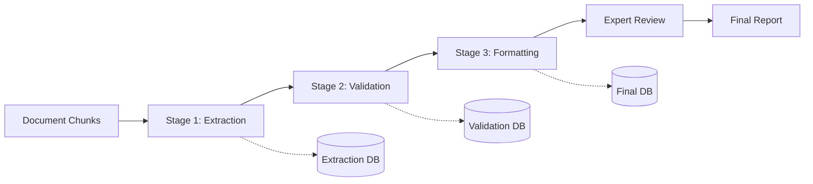

# PFM Bottleneck Analysis Pipeline

## Overview

This repository contains a sophisticated pipeline for identifying and analyzing bottlenecks in Public Financial Management (PFM) systems using AI-powered document analysis. While designed for PFM analysis, the framework is highly adaptable for any domain requiring evidence extraction and validation from large document corpora.

## Key Innovation

Our approach combines:
- **Structured AI Outputs**: Using OpenAI's Instructor library with Pydantic models for guaranteed structured responses
- **Multi-Stage Validation**: Three-stage pipeline (Extraction → Validation → Formatting) with independent checkpoints
- **Expert-in-the-Loop**: Seamless integration of expert review to improve model precision
- **Domain-Specific Reasoning**: Hierarchical validation using sub-questions before final decisions

## Problem Statement

Public Financial Management documents (expenditure reviews, fiscal diagnostics, budget reports) contain valuable evidence of systemic bottlenecks that impede development outcomes. However:
- Documents are lengthy (100s of pages) and numerous
- Evidence is scattered and context-dependent  
- Expert review is expensive and time-consuming
- False positives overwhelm human reviewers

Our solution uses LLMs to identify potential evidence, validate it through structured reasoning, and format it for expert review and reporting.

## Architecture

### Three-Stage Pipeline



1. **Extraction Stage**: Identifies potential evidence from document chunks
   - High recall, accepts borderline cases
   - Filters ~95% of non-relevant chunks
   - Saves extracted evidence with reasoning

2. **Validation Stage**: Validates evidence using structured sub-questions
   - Multiple validation criteria per bottleneck
   - Deterministic override functions for complex logic
   - Confidence scoring (strong/borderline/weak)

3. **Formatting Stage**: Creates report-ready summaries
   - Extracts structured fields (country, policy, constraint, etc.)
   - Generates stylized summaries matching report tone
   - Adds temporal context and metadata

### Technical Stack

- **LLM Integration**: Azure OpenAI with GPT-4
- **Structured Output**: Instructor library + Pydantic models
- **Database**: Apache Spark tables (Databricks)
- **Export**: Excel generation for expert review

## Methodology

### 1. Structured Output Guarantee

We use [Instructor](https://github.com/jxnl/instructor) to wrap OpenAI calls, ensuring responses match our Pydantic models:

```python
class BottleneckEvidence(BaseModel):
    extracted_evidence: str = Field(
        description="Verbatim excerpt providing evidence"
    )
    reasoning: str = Field(
        description="Why this excerpt indicates the bottleneck"
    )
    confidence: ConfidenceLevel
```

This guarantees type-safe, validated outputs from the LLM.

### 2. Hierarchical Validation

Instead of asking "Is this valid evidence?" directly, we decompose into sub-questions:

```python
class ValidationModel(BaseModel):
    mentions_approved_reform: bool
    reform_not_followed_through: bool
    actor_named_or_identifiable: bool
    # ... 15+ specific criteria
    
    is_valid: bool  # Final decision based on above
```

This approach:
- Makes LLM reasoning transparent
- Allows deterministic overrides
- Enables targeted improvements based on failure patterns

### 3. Expert-in-the-Loop Iteration

```
Initial Run → Sample Results → Expert Review → Update Logic → Re-run
```

Experts review samples and provide reasons for disagreement, which we use to:
- Add new validation criteria
- Adjust prompts
- Create bottleneck-specific override functions

## Project Structure

```
structured_pipeline/
├── core/
│   ├── services.py         # LLM service integration
│   ├── database.py         # Database operations
│   ├── models.py           # Base Pydantic models
│   └── pipeline.py         # Orchestration logic
├── bottlenecks/
│   ├── bottleneck_1_1.py  # Each bottleneck module contains:
│   │                       # - Definition & examples
│   │                       # - Extraction model
│   │                       # - Validation model & sub-questions
│   │                       # - Post-validation overrides
│   └── ...
├── formatting/
│   ├── summarization.py   # Evidence formatting
│   └── prompts.py         # Prompt templates
├── utils/
│   ├── excel_export.py    # Export for review
│   └── sampling.py        # Smart sampling strategies
├── config.py              # Configuration
└── main.py               # Example usage
```

## Quick Start

### Prerequisites

- Databricks environment with Spark
- Azure OpenAI access
- Python packages: `instructor`, `openai`, `pydantic`, `pandas`


## Key Design Decisions

### Why Three Stages?

- **Separation of Concerns**: Each stage has different precision/recall targets
- **Iteration Efficiency**: Can re-run validation without re-extraction
- **Resource Optimization**: Expensive LLM calls only on filtered chunks

### Why Structured Outputs?

- **Reliability**: No parsing errors or malformed responses
- **Type Safety**: Compile-time validation of model outputs
- **Consistency**: Same structure across all responses

### Why Sub-Question Validation?

- **Interpretability**: Understand why evidence was accepted/rejected
- **Debugging**: Identify specific failure patterns
- **Improvement**: Target prompt improvements to specific criteria


## References

- [Instructor Library](https://github.com/jxnl/instructor)
- [Pydantic Documentation](https://docs.pydantic.dev/)
- [Azure OpenAI Service](https://azure.microsoft.com/en-us/products/ai-services/openai-service)


**Note**: While designed for PFM bottleneck analysis, this framework is intentionally modular and can be adapted to any domain requiring:
- Evidence extraction from documents
- Multi-criteria validation
- Expert review integration
- Structured report generation

